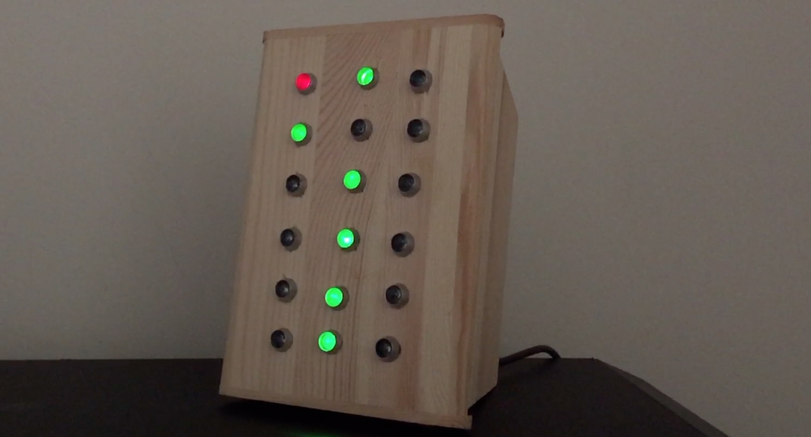

# A true binary alarm clock

This is a custom binary alarm clock I made using an [ATtiny85](http://www.microchip.com/wwwproducts/en/ATtiny85)
microcontroller and few other components.  It's powered by USB and has a
battery backup for remembering the time/alarm setting when it's not externally
powered.

The top-left LED is the alarm indicator, which is solid when the alarm is
enabled, and blinks when it is active.

Columns of LEDs left to right represent hours, minutes, and seconds, with
the most significant bit at the top. True binary means that the clock has
exactly one series of bits representing each time component. This makes it
visually simpler than one that uses [binary-coded decimal](https://en.wikipedia.org/wiki/Binary-coded_decimal).

The clock also supports multiple display modes, which can be used to turn off
certain LEDs (e.g. seconds) in order to make its operation less visually
distracting.

## Usage

There are four buttons, left to right: `MIN`, `HR`, `SET`, and `ALM`.

### Viewing alarm time

* Hold down `ALM`.

### Setting alarm time

* Hold down `ALM` while pressing `MIN` and `HR` as needed.

### Setting time

* Hold down `SET` while pressing `MIN` and `HR` as needed.

### Enabling and disabling alarm

* Hold down `ALM` while pressing `SET` to toggle between enabled/disabled states.
* The red indicator displays when the alarm is enabled.

### Snoozing

* While alarm is active, press `MIN` to enter three-minute snooze mode.
* The buzzer will stop, but the indicator will continue to blink.
* To exit snooze mode, disable the alarm.

### Changing display mode

* Hold down `MIN` while pressing `HR` to advance to the next mode.
* In order, the supported display modes are:
  * Default (all enabled)
  * Seconds off
  * Minutes and seconds off
  * Hours, minutes, and seconds off (indicator lights if alarm enabled)
  * All off (indicator only blinks if alarm or snooze mode is active)

### Testing the alarm

* Hold down `HR` while pressing `MIN` to activate the alarm.
* From this state, you can enter snooze mode or disable the alarm.

## Video

* [Play construction/demo video (1min, 47sec)](https://www.youtube.com/watch?v=zzALC2zqzFU)

## Sources

* [Schematic](https://raw.githubusercontent.com/cwilper/binclock/master/schematic/schematic.png)
* [Source Code](https://github.com/cwilper/binclock/blob/master/code/binclock.ino)
